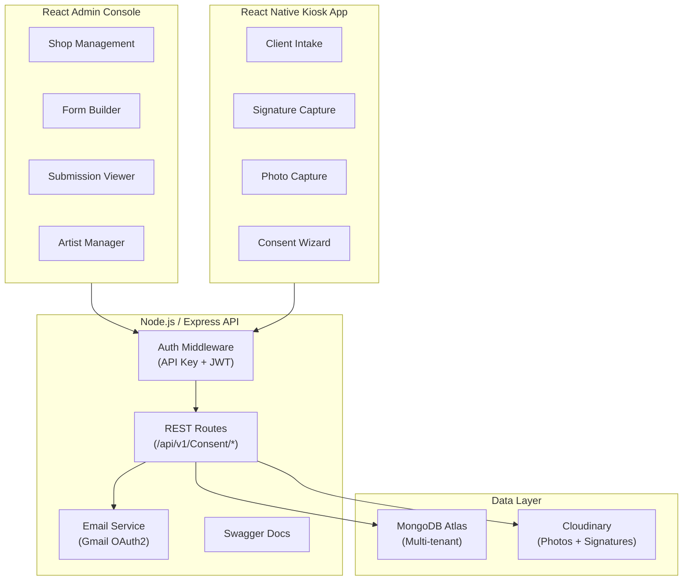
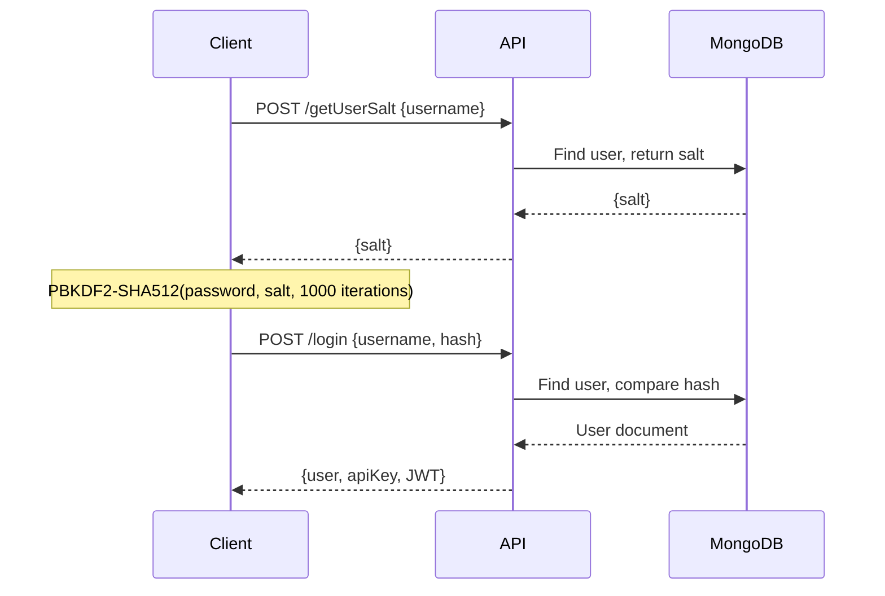
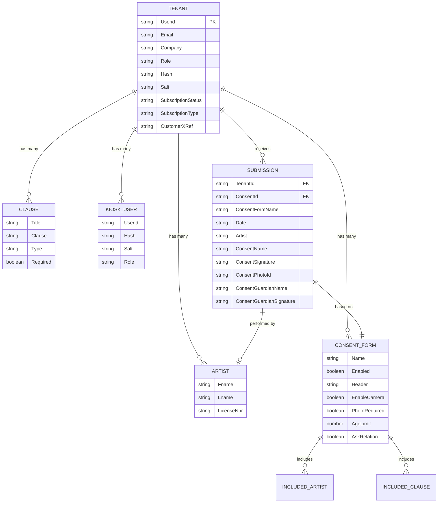

# Tattoo Release Online (TRO) — Production SaaS Platform Case Study

## Overview

Designed, developed, and deployed a comprehensive SaaS platform for the tattoo industry, built entirely on the MERN stack (MongoDB, Express.js, React, Node.js) with a React Native mobile application. Tattoo Release Online (TRO) replaces paper-based consent and release form workflows with a secure digital platform — handling client intake, digital signature capture, photo documentation, legal clause management, and multi-shop administration from a single system.

This is a live production application serving real tattoo studios at [consent.tattooreleaseonline.com](https://consent.tattooreleaseonline.com). This case study documents the full-stack architecture, design decisions, and engineering approach behind the platform — from database schema design to mobile kiosk deployment.

The system comprises three main components: a React admin console for shop owners and managers, a React Native mobile kiosk app for in-shop client intake, and a Node.js/Express API server with MongoDB persistence, Cloudinary media storage, and Gmail OAuth2 email notifications.

---

## The Problem

Tattoo shops manage client intake, consent forms, and release documentation using paper-based processes or fragmented digital tools. This creates compliance risk (lost or incomplete forms), poor client experience (clipboard paperwork on arrival), and operational inefficiency (manual record keeping, no centralized client history).

The challenge was building a unified digital platform that:

- **Replaces paper consent/release workflows** with a secure digital process including legally valid digital signatures
- **Provides shop owners with centralized administration** — artist management, clause configuration, form customization, submission history, and multi-shop oversight
- **Delivers an in-shop kiosk experience** via mobile app — walk-in clients complete intake on a tablet without touching shop computers
- **Handles sensitive personal data and legal signatures** with appropriate security — hashed credentials, cloud-hosted media, and tenant-isolated data
- **Scales as a multi-tenant SaaS** serving multiple independent shops with subscription-based pricing and per-shop data isolation

---

## Architecture

### High-Level System Architecture



### Component Overview

| Component | Technology | Purpose |
|---|---|---|
| **Admin Console** | React 16, Redux, Bootstrap | Shop management, form builder, submission viewer, artist/clause admin |
| **Mobile Kiosk App** | React Native (Expo), Redux | In-shop client intake, digital consent wizard, signature/photo capture |
| **API Server** | Node.js, Express 4.15 | REST API, authentication, business logic, email, Swagger docs |
| **Database** | MongoDB Atlas, Mongoose 7.8 | Multi-tenant data store — users, forms, submissions, subscriptions |
| **Media Storage** | Cloudinary | Digital signatures, client photos, form title images |
| **Email** | Nodemailer + Gmail OAuth2 | Consent submission notifications to shop owners |
| **Documentation** | Swagger UI Express | Interactive API documentation at `/api-docs` |

---

### React Admin Console Architecture

The admin console is a single-page React application with Redux state management, providing shop owners full control over their consent workflow.

**State Management (Redux + Thunk):**

```
Redux Store
├── userLoggedIn      ← Authenticated tenant/user
├── tenants[]         ← Multi-shop tenant list
├── artists[]         ← Shop artist roster
├── clauses[]         ← Legal clause library
├── consents[]        ← Consent form configurations
├── kioskusers[]      ← Kiosk device accounts
├── submissions[]     ← Client consent submissions
└── subscriptions[]   ← Subscription event log
```

Each resource domain follows a consistent pattern: action creators (Redux-Thunk async), reducers, and API integration through a centralized fetch wrapper with `x-api-key` header injection.

**Key Admin Workflows:**

1. **Consent Form Builder** — Multi-step wizard (StepZilla) for creating consent forms: configure form settings → select artists → assign legal clauses → set required fields → enable photo/camera capture → define email notifications
2. **Artist Management** — CRUD for shop artists with license number tracking; artists are assigned to specific consent forms
3. **Clause Management** — Legal clause library with per-clause type classification; clauses can be marked as required or optional per form
4. **Submission Viewer** — Searchable table of all consent submissions with filtering by name, artist, date range; displays captured signatures and photos inline
5. **Kiosk User Admin** — Create and manage kiosk device accounts with independent credentials for tablet-based client intake
6. **Subscription Management** — Monitor subscription status, pricing tiers ($99/month, $1,070/year), multi-shop add-ons ($40/shop)

### React Native Mobile App Architecture

The kiosk app is an Expo-based React Native application designed for in-shop tablet deployment. Clients interact with it directly — no shop staff intervention required for standard intake.

**Client Intake Flow:**

```mermaid
graph LR
    A["Client Arrives"] --> B["Kiosk Login<br/>(Shop Credentials)"]
    B --> C["Select Consent Form"]
    C --> D["Step 1: Select Artist"]
    D --> E["Step 2: Review &<br/>Acknowledge Clauses"]
    E --> F["Step 3: Personal Info"]
    F --> G["Capture Photo<br/>(expo-camera)"]
    G --> H["Digital Signature<br/>(react-native-signature-canvas)"]
    H --> I{Age Verified?}
    I -->|Under Limit| J["Guardian Info +<br/>Guardian Signature"]
    I -->|Over Limit| K["Submit"]
    J --> K
    K --> L["Save to MongoDB +<br/>Upload to Cloudinary"]
    L --> M["Email Notification<br/>to Shop"]
```



**Key Mobile Patterns:**

- **Kiosk authentication**: Dedicated kiosk user accounts (separate from admin accounts) with PBKDF2-hashed credentials and subscription status validation
- **Digital signature capture**: `react-native-signature-canvas` for finger/stylus input on mobile devices; signatures encoded as base64 and uploaded to Cloudinary
- **Photo capture**: `expo-camera` integration with real-time preview; photos uploaded directly to Cloudinary with SHA-1 signed requests
- **Age verification**: Automatic age calculation from date of birth; triggers parent/guardian consent workflow when client is under the configured age limit
- **Cross-platform polyfills**: Node.js crypto modules (PBKDF2) shimmed for React Native via browserify-compatible packages

### API Architecture

The Express API serves both the admin console and mobile kiosk app through a RESTful interface organized around the consent domain model.

**Route Structure:**

```
/api/v1/Consent/
├── login                           ← Admin authentication
├── getUserSalt                     ← Salt retrieval for client-side hashing
├── loginkioskuser                  ← Kiosk web login
├── loginkioskusermobile            ← Kiosk mobile login
├── getkioskusersalt                ← Kiosk salt retrieval
├── sendmail                        ← Email dispatch
├── tenants/                        ← Tenant CRUD
│   ├── :_id                        ← Single tenant
│   ├── subscriptionstatus/:_id     ← Subscription check
│   ├── artists/:_id                ← Artist CRUD (nested)
│   ├── clauses/:_id                ← Clause CRUD (nested)
│   ├── consents/:_id               ← Consent form CRUD (nested)
│   ├── consent/artists/:_id        ← Form ↔ Artist assignment
│   ├── consent/clauses/:_id        ← Form ↔ Clause assignment
│   └── kioskusers/:_id             ← Kiosk user CRUD (nested)
├── submissions/                    ← Submission CRUD
│   ├── :_id                        ← By tenant / update / delete
│   └── submission/:_id             ← Single submission
└── subscriptions/                  ← Subscription events
    └── subscription/:_id           ← Single event
```

**Middleware Stack:**
- CORS (cross-origin request handling)
- Body parser (50MB limit for image payloads)
- Cookie parser with session support
- Morgan HTTP request logging
- API key validation (`x-api-key` header)
- JWT token verification (7-day expiration)
- Swagger UI at `/api-docs`

**Authentication Flow:**



### Database Schema Design

MongoDB with Mongoose ODM. The schema follows a document-embedding strategy — artists, clauses, consent forms, and kiosk users are embedded as sub-documents within the tenant (user) document. Submissions are stored as a separate top-level collection with tenant ID references.

**Entity Relationship:**



**Why document embedding for tenant data:**
- Artists, clauses, and forms are always accessed in the context of a single tenant — never queried across tenants
- Embedding eliminates joins (MongoDB doesn't support them natively) and provides atomic read/write within a tenant
- Submissions are a separate collection because they grow unboundedly and are queried with pagination, filtering, and date ranges

---

## Design Decisions

### 1. MERN Stack Selection

**Decision:** Full MERN stack — MongoDB, Express.js, React, Node.js.

**Why:** JavaScript end-to-end from database (JSON documents) to API (Node/Express) to frontend (React) to mobile (React Native). A single language across the entire stack reduces context-switching, enables code sharing between web and mobile, and leverages the npm ecosystem for every layer. MongoDB's document model naturally fits the consent form use case — forms are documents with nested clauses, artists, and configuration.

**Trade-off:** MongoDB's eventual consistency model and lack of enforced foreign keys require discipline in application-level data integrity. Relational databases provide stronger consistency guarantees. Accepted because the document-oriented data model (forms, submissions, tenant profiles) maps more naturally to MongoDB than to relational tables.

### 2. React Native (Expo) for Mobile vs Native

**Decision:** React Native via Expo over native iOS/Android development.

**Why:** Code sharing with the admin console (Redux actions, API patterns, business logic). Single language (JavaScript) across the entire stack. Expo provides managed builds, OTA updates, and device API access (camera, filesystem) without native module compilation. The kiosk use case doesn't require heavy native performance — it's forms, signatures, and camera capture.

**Trade-off:** Expo limits access to some native APIs and adds bundle size overhead from polyfills (browserify shims for crypto, stream, etc.). Pure native would have smaller bundles and direct API access. Accepted because development velocity and code reuse outweigh the marginal performance difference for a form-based kiosk app.

### 3. Document Embedding vs Reference Strategy

**Decision:** Embed artists, clauses, consent forms, and kiosk users as sub-documents within the tenant document. Store submissions as a separate collection with tenant ID reference.

**Why:** Tenant data (artists, clauses, forms) is always accessed together and is bounded in size (a shop has tens of artists and clauses, not thousands). Embedding provides atomic reads — one query returns the entire tenant context. Submissions are unbounded (grow over time) and require independent pagination, filtering, and aggregation, so they're stored separately.

**Trade-off:** Updating a single nested artist requires rewriting the parent tenant document. For the expected data volumes (small number of artists/clauses per shop), this is acceptable. Would not scale to entities with high write frequency or large cardinality.

### 4. PBKDF2 Password Hashing

**Decision:** PBKDF2 with SHA-512 (1000 iterations) and per-user random salt for all password storage — both admin and kiosk accounts.

**Why:** Industry-standard password hashing that's available natively in Node.js crypto and can be shimmed in React Native via browserify. Per-user salt prevents rainbow table attacks. The same hashing algorithm runs identically on server (Node.js), web client (browser crypto), and mobile client (React Native polyfill).

**Trade-off:** PBKDF2 at 1000 iterations is less computationally expensive than bcrypt or Argon2, offering slightly less brute-force resistance. Accepted because the cross-platform compatibility (Node.js + React Native without native modules) was a hard requirement.

### 5. Cloudinary for Media Storage

**Decision:** Cloudinary for all media assets — client photos, digital signatures, and form title images.

**Why:** Direct client-side uploads (no API server bottleneck for large files), CDN-backed delivery, automatic format optimization, and simple asset management via `public_id`. The SHA-1 signed upload pattern provides upload authentication without exposing the full API secret to the client.

**Trade-off:** External service dependency and per-asset storage costs. Self-hosted object storage (S3, MinIO) would reduce per-unit cost at scale. Accepted because Cloudinary's upload widget, transformation pipeline, and CDN eliminate significant engineering effort for a small team.

### 6. Multi-Tenant with Shared Database

**Decision:** Shared MongoDB database with tenant ID isolation (not separate databases per tenant).

**Why:** Operational simplicity — one database to back up, monitor, and index. Tenant data is embedded within user documents, providing natural isolation without query-level filtering. Submissions reference tenant IDs for cross-collection lookups.

**Trade-off:** A misbehaving tenant's large submission volume could affect database performance for others. Separate databases would provide stronger isolation. Accepted because the expected tenant count and data volume don't warrant the operational overhead of per-tenant database management.

### 7. Gmail OAuth2 for Email

**Decision:** Gmail OAuth2 (migrated from SMTP app passwords) for consent submission email notifications.

**Why:** Google deprecated less-secure app passwords for Gmail SMTP in May 2022. OAuth2 provides secure, token-based access without storing plaintext passwords. Nodemailer's OAuth2 transport handles token refresh automatically.

**Trade-off:** OAuth2 configuration is more complex than SMTP (requires Google Cloud Console setup, refresh token management). Accepted because it's now the only supported method for Gmail programmatic access.

### 8. Subscription-Based Access Control

**Decision:** Subscription status checked at login time (both admin and kiosk) and enforced at the API level. Expired subscriptions prevent form submissions.

**Why:** SaaS revenue model requires access gating. Checking at login prevents unauthorized use while keeping the API simple — no per-request subscription validation overhead.

**Trade-off:** Subscription status is checked against a stored date, not a real-time payment provider query. If a payment fails silently, the cached subscription date could grant access beyond the paid period. Mitigated by subscription event logging and periodic reconciliation.

---

## Technical Stack Detail

| Layer | Technology | Details |
|---|---|---|
| **Frontend (Web)** | React 16.4, Redux 4.0, Redux-Thunk | Bootstrap 3.3, SASS, StepZilla wizards, react-signature-canvas |
| **Frontend (Mobile)** | React Native 0.68, Expo 45, Redux | React Navigation 6, expo-camera, react-native-signature-canvas |
| **Backend** | Node.js, Express 4.15 | Mongoose 7.8, Nodemailer, express-session, cookie-parser, Morgan |
| **Database** | MongoDB Atlas | Mongoose ODM, document embedding, separate submissions collection |
| **Authentication** | PBKDF2-SHA512 + JWT | Per-user salt, 7-day token expiry, dual auth (admin + kiosk) |
| **Media Storage** | Cloudinary | SHA-1 signed uploads, CDN delivery, public_id asset management |
| **Email** | Gmail OAuth2 via Nodemailer | HTML templates, consent notification delivery |
| **API Docs** | Swagger UI Express | Interactive documentation at `/api-docs` |
| **Hosting** | MongoDB Atlas (database), Cloudinary (media) | Production domain: consent.tattooreleaseonline.com |

---

## Product Lifecycle

### Requirements & Design
TRO was born from a real gap observed in the tattoo industry — studios using paper clipboards for client intake, losing forms, and facing compliance risk for incomplete records. Requirements were gathered directly from studio owners, focusing on three pain points: paper waste, lost records, and walk-in client friction.

### Development Methodology
Built incrementally: API and data model first, then admin console, then mobile kiosk app. Each component was developed as an independent module sharing the same API backend. Features were prioritized by studio impact — consent submission workflow first, admin management second, subscription billing third.

### Testing Approach
- **API testing**: Swagger UI for endpoint validation and manual integration testing
- **Frontend**: Component-level testing with Jest (Expo preset for mobile)
- **End-to-end**: Manual testing of the full consent flow (kiosk login → form selection → intake → submission → admin view)

### Deployment
- **API**: Node.js deployed with MongoDB Atlas (cloud-hosted database)
- **Admin Console**: React build deployed as static assets
- **Mobile**: Expo-managed builds for iOS/Android distribution
- **Media**: Cloudinary handles all photo and signature storage with CDN delivery

### Monitoring
- MongoDB Atlas provides database performance monitoring, alerting, and backup
- Express Morgan middleware provides HTTP request logging
- Cloudinary dashboard monitors storage usage and bandwidth

---

## Lessons Learned

### 1. Document Embedding Works Until It Doesn't
Embedding artists and clauses inside the tenant document simplified reads dramatically — one query gets everything. But updating a single nested artist requires rewriting the parent document. For TRO's scale (tens of artists per shop), this is fine. For entities that update frequently or grow large, a reference-based approach with separate collections would be necessary. The lesson: choose your embedding boundaries based on update patterns, not just read patterns.

### 2. Cross-Platform Crypto Is Harder Than Expected
Running PBKDF2 identically across Node.js, browser, and React Native required significant polyfill work. React Native doesn't have native `crypto` — it needs browserify shims, which pull in `stream`, `buffer`, and other Node.js modules. The resulting dependency chain (`react-native-crypto` → `react-native-randombytes` → `react-native-os` → etc.) adds bundle size and occasional build issues. If starting over, would evaluate Web Crypto API compatibility first.

### 3. Kiosk Mode Needs Its Own Auth Model
The initial design used the same admin credentials for kiosk access. This was wrong — shop owners don't want their admin password on a tablet sitting on the front counter. Creating a separate kiosk user model with limited permissions (can create submissions, cannot modify forms or view other tenants) was the right architectural call. Separate auth models for separate threat profiles.

### 4. Cloudinary Direct Upload Is Worth the Complexity
The alternative was uploading images through the API server (client → API → Cloudinary). Direct upload (client → Cloudinary, with signed credentials) eliminates the API server as a bottleneck for large image payloads and reduces server memory/bandwidth requirements. The SHA-1 signing adds setup complexity but pays for itself in production performance.

### 5. Subscription Enforcement Must Be Multi-Layered
Checking subscription status only at login created a loophole — long-running sessions could continue submitting after subscription expiry. Adding pre-submission checks and periodic re-validation closed the gap. For SaaS platforms, access control must be enforced at every state transition, not just at the entry point.

### 6. Multi-Step Wizards Need State Preservation
The consent form wizard (select artist → acknowledge clauses → personal info → signature) was initially fragile — navigating back and forward would lose form state. Moving all wizard state into Redux (rather than component-local state) solved this and enabled features like "save and resume" for partially completed submissions.
