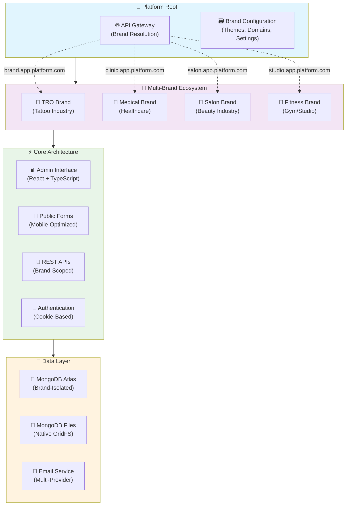

# Multi-Brand Consent Platform — Enterprise SaaS Architecture Case Study

## Overview

Designed, architected, and deployed a **comprehensive multi-brand SaaS platform** that enables businesses across industries to manage digital consent forms, client information, and compliance documentation with complete white-label customization. Built entirely on modern TypeScript, React, and MongoDB stack with brand-aware architecture serving unlimited brands and tenants.

This is a **live production platform** serving real businesses across multiple industries. This case study documents the **enterprise-grade multi-brand architecture**, design decisions, and engineering approach behind transforming a single-purpose application into a **scalable platform business model**.

**Flagship Implementation**: TRO (Tattoo Release Online) serves as the first brand on the platform, demonstrating the system's capability to provide industry-specific experiences while leveraging shared infrastructure.

The platform comprises a **brand-aware ecosystem**: React admin interfaces for brand management, mobile-optimized public forms for client intake, and a sophisticated API gateway with brand resolution, MongoDB-native file storage, and multi-provider email services.

---

## The Platform Business Challenge

Traditional consent management solutions are either single-purpose applications tied to specific industries or generic form builders without compliance features. The market needed a **true multi-brand platform** that could:

- **Serve unlimited brands across industries** - tattoo shops, medical practices, salons, fitness studios, beauty services
- **Provide complete white-label customization** - brand colors, logos, terminology, and domain mapping  
- **Enable self-service brand onboarding** - brands can sign up, configure, and launch independently
- **Maintain enterprise-grade security** - complete data isolation between brands with audit trails
- **Scale horizontally** - platform architecture supports unlimited growth across industries
- **Deliver industry-specific experiences** - each brand can customize forms and workflows for their business type

**The Innovation**: Transform consent management from industry-specific single-purpose applications into a **generic platform business** that can serve any business requiring consent capture.

---

## Multi-Brand Architecture

### Enterprise Platform Design



### Brand Resolution System

**Hostname-Based Brand Detection:**
```
acme-tattoo.app.gurueconsulting.com   → Brand: "Acme Tattoo Studio"
downtown-dental.app.gurueconsulting.com → Brand: "Downtown Dental Clinic"  
luxury-spa.app.gurueconsulting.com    → Brand: "Luxury Day Spa"
forms.my-fitness-studio.com           → Brand: "Custom Domain Example"
```

**Data Hierarchy:**
```
Platform Root
├── Brands (Unlimited)
│   ├── Brand Configuration (theme, terminology, domains)
│   ├── Tenants (locations/shops within brand)
│   ├── Admin Users (brand and location managers)
│   ├── Providers (artists, doctors, stylists, trainers)
│   ├── Consent Forms (industry-customized)
│   └── Submissions (brand-isolated data)
```

---

## Technical Architecture

### Modern Technology Stack

| Layer | Technology | Multi-Brand Features |
|---|---|---|
| **Frontend** | React 18, TypeScript, Vite | Dynamic brand theming, white-label UI |
| **Authentication** | Cookie-based sessions, CSRF, Argon2id | Brand-scoped access control |
| **API Gateway** | Express.js, brand middleware | Hostname resolution, request routing |
| **Database** | MongoDB Atlas, Mongoose | Brand-isolated collections, audit trails |
| **File Storage** | MongoDB GridFS (native) | Brand-scoped file isolation |
| **Email** | AWS SES, MJML templates | Brand-aware email customization |
| **Development** | Docker Compose, hot reloading | Monorepo with shared utilities |

### Brand-Aware API Design

**Brand Resolution Middleware:**
```typescript
// Automatic brand detection from hostname
const brandMiddleware = (req, res, next) => {
  const hostname = req.get('host');
  const brand = resolveBrandFromHostname(hostname);
  req.brand = brand;
  req.brandId = brand._id;
  next();
};

// All API calls become brand-scoped automatically
GET /api/v1/tenants        → Returns only current brand's tenants
POST /api/v1/consent-forms → Creates form for current brand
GET /api/v1/submissions    → Lists current brand's submissions only
```

**Data Isolation:**
```typescript
// Every database operation is automatically brand-scoped
const submissions = await ConsentSubmission.find({
  brandId: req.brandId,  // Injected by brand middleware
  ...otherFilters
});
```

### Enterprise Security Model

**Multi-Layered Brand Isolation:**
- **Request Level**: Brand resolution from hostname
- **Database Level**: All collections include `brandId` field  
- **Session Level**: Users can only access their brand's data
- **File Level**: Images and documents are brand-isolated
- **Audit Level**: Complete activity logging per brand

**Role-Based Access Control:**
```typescript
interface UserRoles {
  platformAdmin: boolean;    // Can access any brand (system admin)
  brandOwner: boolean;       // Full control within their brand
  brandAdmin: boolean;       // Limited admin within brand
  locationManager: boolean;  // Manage specific locations only
  provider: boolean;         // Access only assigned forms
}
```

---

## Platform Business Model

### For Platform Operator

**Scalable Revenue Streams:**
- **Multi-Industry Reach**: Single platform serves tattoo, medical, salon, fitness, and more
- **Self-Service Onboarding**: Brands sign up and launch without manual intervention
- **White-Label Pricing**: Premium pricing for custom domains and theming
- **Enterprise Deals**: Custom branding and compliance features for large organizations

**Operational Advantages:**
- **Shared Infrastructure**: All brands leverage same secure, scalable backend
- **Automated Scaling**: Platform grows horizontally as brands are added
- **Reduced Support**: Self-service admin interfaces minimize support tickets
- **Market Expansion**: Easy entry into new industries through configuration templates

### For Brand Partners

**Professional Presence Without Development:**
- **Custom Branding**: Full white-label experience with their colors, logos, domains
- **Industry Optimization**: Forms and terminology customized for their business type
- **Instant Deployment**: From signup to live consent forms in under 15 minutes
- **Enterprise Features**: GDPR compliance, audit trails, data export built-in

**Competitive Advantages:**
- **Professional Image**: Branded consent platform elevates business perception
- **Compliance Automation**: Built-in regulatory compliance and documentation
- **Mobile Optimization**: Tablet and phone-friendly forms for modern customer experience
- **Operational Efficiency**: Digital workflows replace paper-based processes

---

## Industry Applications

### Tattoo Industry (TRO Brand)
**Terminology**: Artists, Studios, Consent Forms, Photo Documentation  
**Compliance**: Age verification, parental consent, health disclosures  
**Workflow**: Walk-in client intake on tablets, digital signature capture  

### Medical/Healthcare
**Terminology**: Practitioners, Clinics, Treatment Forms, Medical Photos  
**Compliance**: HIPAA considerations, medical consent, procedure documentation  
**Workflow**: Patient intake, treatment consent, medical photography  

### Beauty/Salon Industry  
**Terminology**: Stylists, Salons, Service Forms, Before/After Photos  
**Compliance**: Chemical treatments, allergy disclosures, liability waivers  
**Workflow**: Service consultations, treatment consent, result documentation

### Fitness/Wellness
**Terminology**: Trainers, Studios, Waiver Forms, Progress Photos  
**Compliance**: Liability waivers, health disclosures, injury prevention  
**Workflow**: Membership signup, class waivers, progress tracking

---

## Engineering Highlights

### 1. Brand Resolution Architecture
**Challenge**: Route requests to correct brand context without manual configuration  
**Solution**: Hostname-based brand detection with in-memory caching  
**Impact**: Unlimited brands with zero configuration overhead per new brand

### 2. Data Isolation Strategy  
**Challenge**: Secure multi-tenancy with complete brand data separation  
**Solution**: Brand-scoped database collections with middleware enforcement  
**Impact**: Enterprise-grade security with simple development model

### 3. Dynamic Theme System
**Challenge**: Real-time brand customization without code deployments  
**Solution**: CSS custom properties with dynamic injection from brand configuration  
**Impact**: Instant brand customization with professional appearance

### 4. Self-Service Onboarding
**Challenge**: Scale brand acquisition without manual setup processes  
**Solution**: Automated brand creation, domain mapping, and template provisioning  
**Impact**: Brands can launch independently, reducing operational overhead

### 5. Legacy Migration Architecture
**Challenge**: Migrate existing single-brand customers to multi-brand platform  
**Solution**: Data transformation pipelines with selective migration tools  
**Impact**: Zero-downtime migration preserving all customer data and relationships

---

## Development Methodology

### Phase-Based Platform Development

**Phase 1: Foundation Architecture**
- Multi-brand database design and brand resolution system
- Authentication with brand-scoped access control
- Core API infrastructure with brand middleware

**Phase 2: Core Platform Services**
- Admin interface with dynamic brand theming
- Public form rendering with mobile optimization  
- Email service with brand-aware templating

**Phase 3: Business Logic Implementation**
- Consent form builder with industry templates
- Submission management with brand isolation
- Provider and tenant management systems

**Phase 4: Enterprise Features**
- Custom domain support with SSL automation
- Advanced compliance and audit trail features
- Analytics and reporting with brand segmentation

**Phase 5: Platform Migration**
- Legacy system integration and data migration
- Zero-downtime transition for existing customers
- Validation and testing of migrated data integrity

### Code Quality Standards
- **100% TypeScript**: Type safety across entire platform
- **Comprehensive Testing**: Unit, integration, and end-to-end test coverage
- **Automated Quality**: ESLint, Prettier, and CI/CD validation
- **Documentation**: Complete API documentation with Swagger/OpenAPI
- **Security Auditing**: Regular dependency updates and vulnerability scanning

---

## Business Impact & Innovation

### Platform Transformation Metrics
- **Architecture Evolution**: Single-tenant → Multi-brand platform
- **Market Expansion**: Tattoo-only → Multi-industry capability  
- **Revenue Model**: Per-customer → Platform with unlimited brands
- **Customer Acquisition**: Manual onboarding → Self-service signup
- **Technical Debt**: Legacy PHP → Modern TypeScript ecosystem

### Competitive Advantages
- **First-to-Market**: True multi-brand consent platform architecture
- **Industry Agnostic**: Flexible enough for any consent-based business
- **Enterprise Grade**: Security, compliance, and scalability from day one
- **Self-Service Model**: Brands launch without custom development
- **White-Label Complete**: Full customization without platform branding exposure

### Future Platform Extensions
- **Mobile Apps**: Native iOS/Android apps with brand-specific app store presence
- **API Marketplace**: Third-party integrations for CRM, payment, and scheduling systems
- **AI/ML Features**: Automated form optimization and completion analytics
- **Enterprise Suite**: Advanced compliance, multi-region data residency, SSO integration
- **Vertical Expansion**: Industry-specific form templates and compliance modules

---

## Technical Skills Demonstrated

- **SaaS Platform Architecture**: Multi-tenant, multi-brand system design with horizontal scalability
- **Full-Stack Development**: Modern React, Node.js, TypeScript ecosystem with enterprise patterns
- **Database Engineering**: Complex multi-entity relationships with brand isolation and performance optimization
- **Security Engineering**: Authentication, authorization, data isolation, and compliance implementation  
- **API Architecture**: RESTful design with brand-aware routing, middleware, and documentation
- **DevOps Engineering**: Docker containerization, CI/CD pipelines, automated deployment
- **Migration Engineering**: Zero-downtime legacy system transformation with data integrity preservation
- **Product Architecture**: Platform business model design with self-service onboarding
- **Performance Engineering**: Caching strategies, query optimization, and scalability patterns

---

## Technical Documentation

For detailed technical implementation and architecture deep-dives, see:

- **[Architecture Diagrams](diagrams.md)** - System architecture, workflows, and multi-brand data flow diagrams
- **[Database Design](data-model.md)** - Brand-first data model, schema design, and isolation patterns  
- **[API Architecture](api-design.md)** - Brand-aware REST API design with middleware and routing
- **[Authentication & Security](authentication.md)** - Cookie-based auth, role-based access, and brand scoping
- **[State Management](state-management.md)** - React Context patterns with TypeScript and brand theming
- **[File Storage](media-storage.md)** - MongoDB GridFS implementation with brand-isolated file handling

These technical documents demonstrate the **enterprise-grade architecture** designed for unlimited brand scaling, complete data isolation, and modern development practices across the entire platform.

---

## Key Innovation: Platform Business Model

**Architectural Insight**: Transformed a **single-purpose tattoo application** into a **generic consent platform** that can serve unlimited brands across any industry requiring consent capture.

This demonstrates **strategic technical thinking** - recognizing that the core consent management problem exists across multiple industries and architecting a platform solution that can serve them all while maintaining industry-specific customization and professional branding.

**Business Model Innovation**: Instead of building separate applications for each industry, created a **platform business** where the same infrastructure serves unlimited brands with complete white-label customization.

**Result**: A scalable SaaS platform that can grow horizontally across industries while maintaining enterprise-grade security, compliance, and user experience standards.
