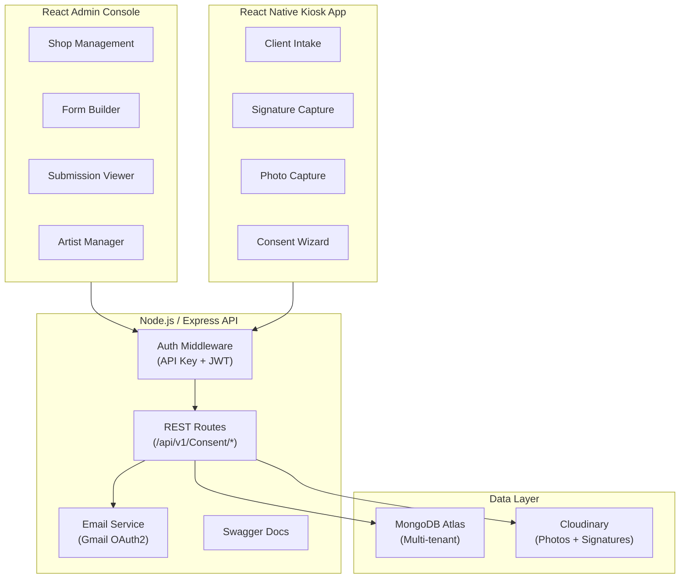
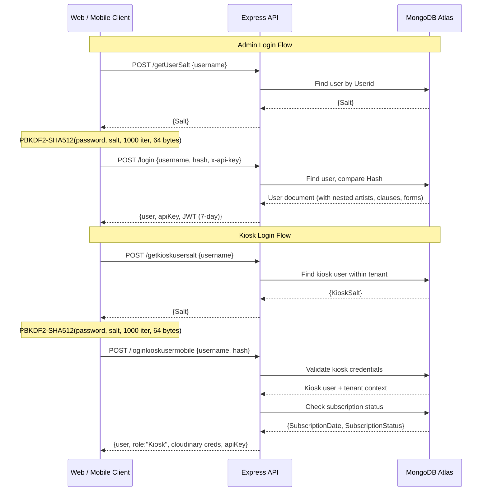
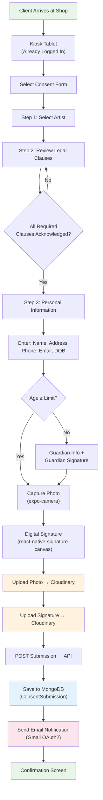
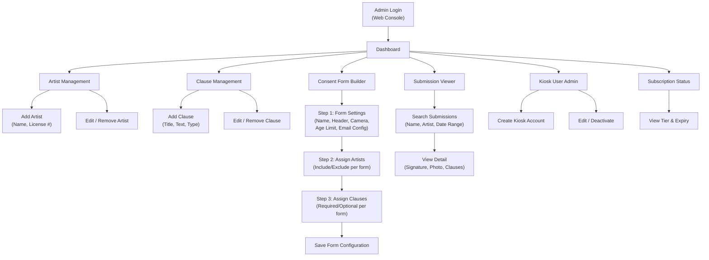
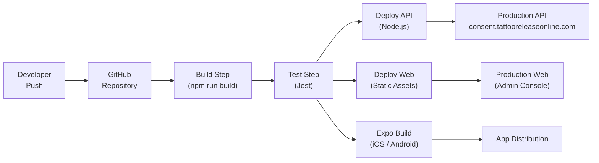
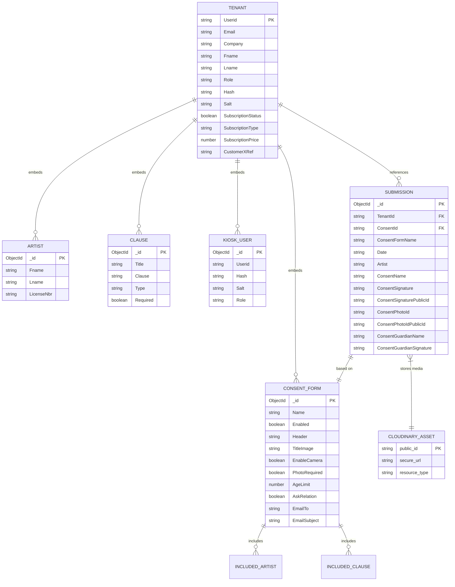

# Architecture Diagrams — Tattoo Release Online (TRO)

## 1. High-Level System Architecture

## 2. Authentication Flow

Dual authentication model — admin accounts and kiosk accounts use the same PBKDF2 algorithm but separate credential stores and login endpoints.

## 3. Client Intake Workflow (Kiosk)

The complete flow from client arrival to stored consent submission.

## 4. Admin Workflow

Shop owner management flows through the admin console.

## 5. CI/CD Pipeline

## 6. Database Entity Relationship

