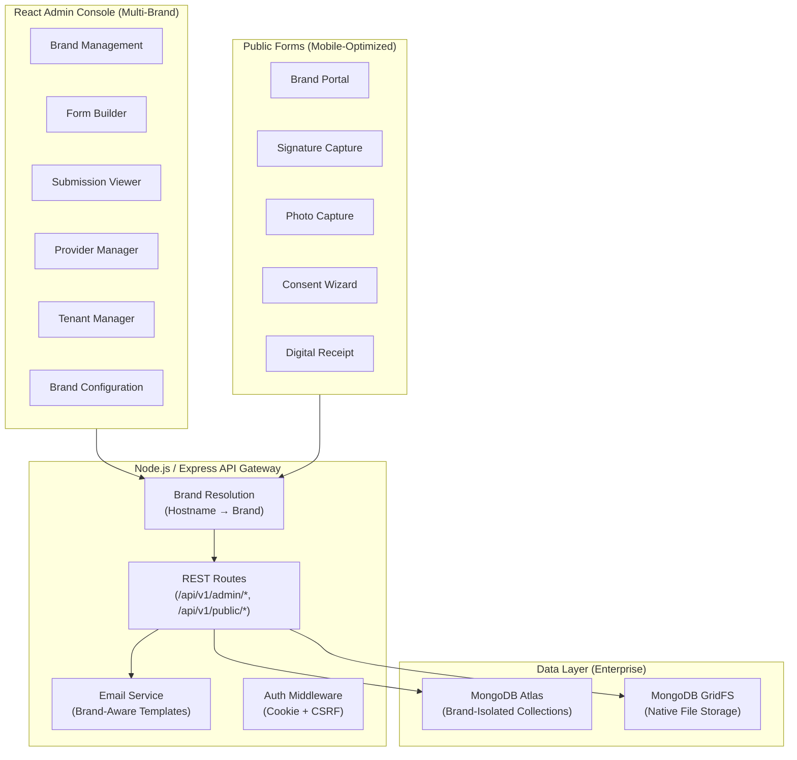
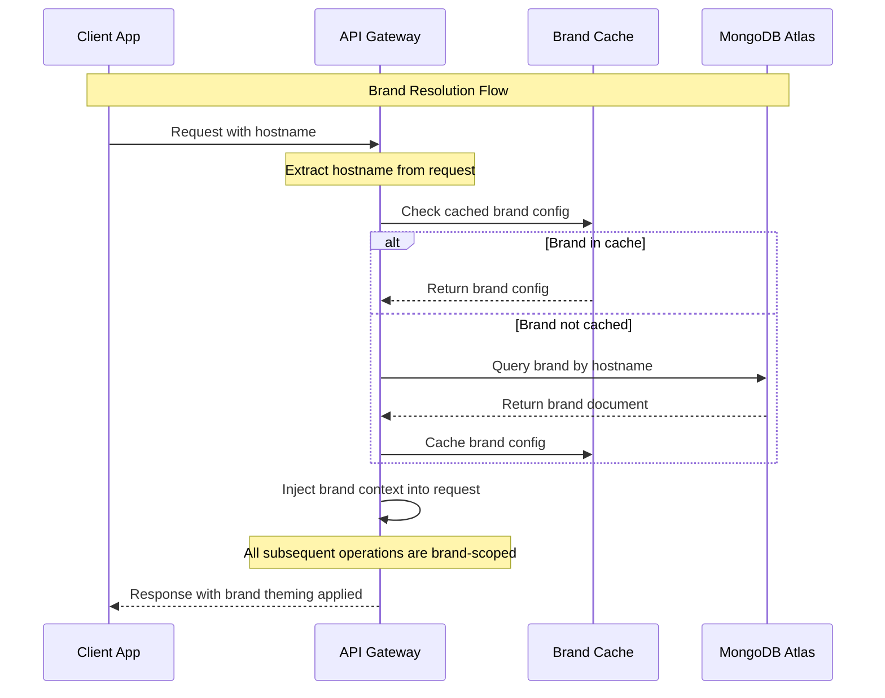
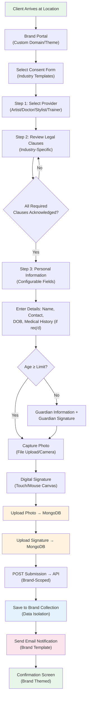
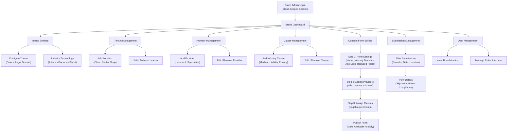
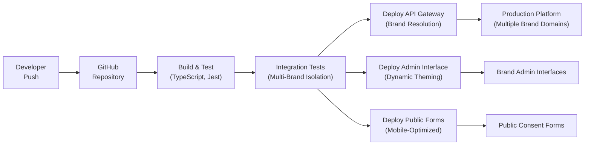
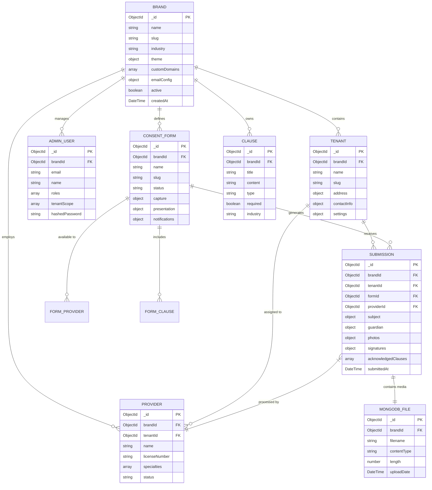

# Architecture Diagrams — Multi-Brand Consent Platform

## 1. High-Level System Architecture

## 2. Brand Resolution Flow

Multi-brand platform with hostname-based brand detection and complete data isolation.

## 3. Multi-Brand Client Intake Workflow

Generic consent capture flow that adapts to any industry with brand-specific terminology and requirements.

## 4. Brand Admin Workflow

Platform administration enabling self-service brand management across industries.

## 5. Platform CI/CD Pipeline

## 6. Multi-Brand Database Architecture

